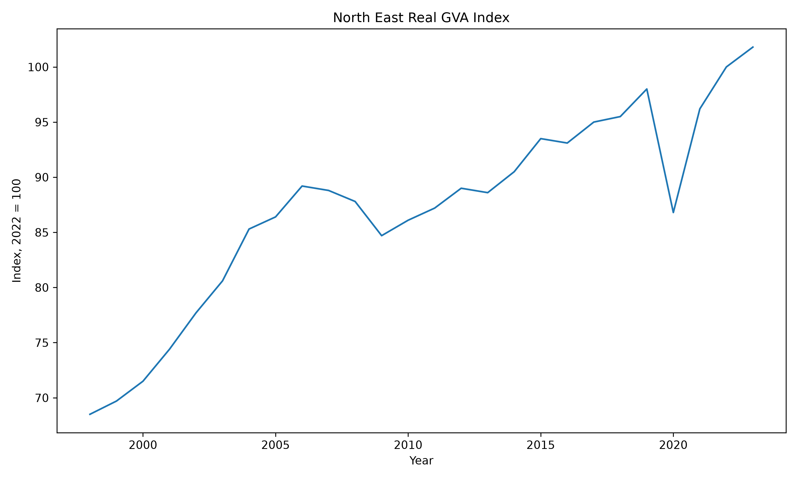
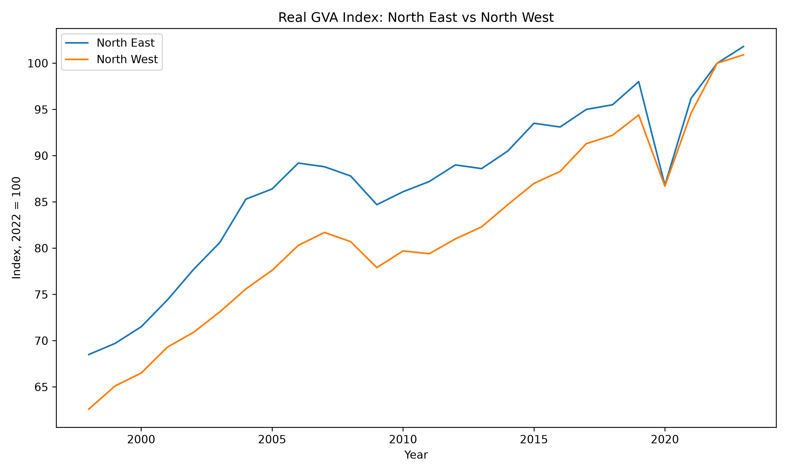
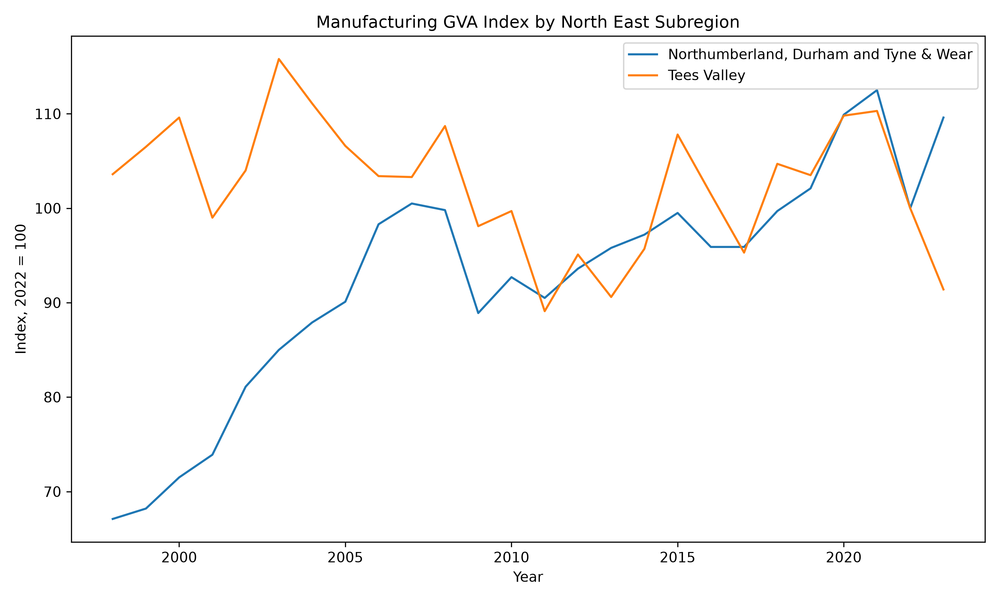

# NE-Offshore-Investment
Database for Green project investments in the North East of England 
# North East Green Investment Intelligence

A reproducible data platform for analysing economic resilience, sector performance and green investment opportunities across North East England.

## Project objective

This project aims to identify which North East sectors and companies are best positioned to benefit from investment in offshore wind, electrification and advanced manufacturing.

The platform will combine regional economic indicators, company financial data, investment announcements and transaction data within a structured SQL database.

## Current progress

The first working ETL pipeline has been completed.

It currently:

* reads the ONS regional GVA workbook;
* extracts the North East all-industries real GVA index;
* converts the source data into a clean annual time series;
* validates missing values and duplicates;
* loads the observations into a SQLite database;
* calculates annual growth rates;
* generates a reproducible chart;
* tests the transformation and analysis outputs automatically.

## Current output

### North East real GVA index



### North East vs North West comparison



Both series are ONS chained-volume-measures indices where 2022 equals 100. The comparison shows relative growth paths, not the absolute size of 
each regional economy.

### Manufacturing GVA by North East subregion



This chart compares manufacturing output trends in Tees Valley with Northumberland, Durham and Tyne & Wear. Both series are indexed to 2022 = 100, so the chart shows relative performance rather than absolute economic size.

## Repository structure

```text
config/       Project configuration files
data/         Raw, interim, processed and reference data
database/     SQL schema and views
src/          Python extraction, transformation, loading and analysis code
tests/        Automated data-quality tests
dashboard/    Streamlit dashboard development
reports/      Generated figures, tables and methodology
docs/         Data dictionary and technical documentation
```

## Running the project

Create and activate a virtual environment:

```bash
python3 -m venv .venv
source .venv/bin/activate
```

Install dependencies:

```bash
pip install -r requirements.txt
```

Create the SQLite database:

```bash
python -m src.ne_investment.load.create_database
```

Load the North East GVA data:

```bash
python -m src.ne_investment.load.ons_gva
```

Run the analysis:

```bash
python -m src.ne_investment.analysis.gva_analysis
```

Generate the chart:

```bash
python -m src.ne_investment.analysis.gva_chart
```

Run the automated tests:

```bash
python -m pytest
```
### Run the full pipeline

To create the database and load all currently supported datasets in the correct order, run:

```bash
python -m src.ne_investment.load.run_pipeline

## Planned development

Future stages will include:

* additional ONS employment, productivity and sector indicators;
* Companies House company-level data;
* green investment and infrastructure projects;
* regional M&A and funding activity;
* sector and company attractiveness screens;
* forecasting and scenario analysis;
* an interactive Streamlit dashboard;
* a final investment research report.

## Data sources

Current source:

* Office for National Statistics — Regional gross value added balanced by industry

Planned sources:

* Companies House
* North East Evidence Hub
* UK government energy and investment datasets
* company filings and announcements
* publicly available transaction and investment news

## Important note

Raw source files and the local SQLite database are not stored in the public repository. The repository contains the code, schema and documentation required to reproduce the analysis.

This project is an independent research project and does not constitute investment advice.

